# Sleep-Health-and-Lifestyle-Analysis
Uncovering the Relationships Between Sleep Quality, Lifestyle Factors, and Overall Health

## Introduction
Sleep is a fundamental element of human life, it has known that sleep-deprived issues and illness have an singificant impact on our daily lives, productivity, and long-term wellbeing. Therefore, understanding the factors that influence sleep quality and duration is crucial for developing better health interventions and promoting healthier lifestyle choices.

This project presents a comprehensive analysis of **the Sleep Health and Lifestyle Dataset**  from [Kaggle](https://www.kaggle.com/datasets/uom190346a/sleep-health-and-lifestyle-dataset/data), collected with 400 individual records. The dataset provides an overview of sleep health by including demographic information (gender, age, occupation), sleep metrics (duration and quality), lifestyle behaviors (physical activity level, daily steps), physiological indicators (BMI category, blood pressure, heart rate), psychological factors (stress levels), and clinical outcomes (presence or absence of sleep disorders).

This dataset gives an unique opportunity to understand how various aspects of modern lifestyle intersect with sleep health across different demographics and occupations, enabling us to uncover patterns that may inform personalized health recommendations.

## Research Objectives
The goals of this analytic project are to :

1. Explore sleep duration patterns across different demographic groups (gender, occupation) and lifestyle factors (BMI, sleep disorders)
2. Analyze sleep quality variations in relation to demographic characteristics (gender, occupation), health indicators (BMI), and sleep disorders
3. Investigate the relationship between lifestyle factors and sleep outcomes:
    - Stress levels and their impact on sleep quality
    - Physical activity levels and their correlation with sleep quality
4. Examine sleep disorder prevalence and distribution across:
    - Overall population frequency
    - Gender differences
    - BMI categories
    - Occupational groups
5. Assess the impact of sleep disorders on:
    - Sleep quality ratings
    - Stress level associations
6. Generate actionable insights for improving sleep health and well-being
  

## Why This Analysis Matters

Sleep plays a major role in physical and mental health status. Poor sleep is known to be associated with obesity, depression, and chronic diseases. By identifying at-risk groups, we can better understand how lifestyle and demographics shape sleep health.

Therefore, this project aims to provide evidence-based insights that can help individuals optimize their lifestyle choices, enable healthcare providers to identify at-risk populations, and contribute to the broader understanding of sleep health determinants in modern society.

## Dataset Overview
The Sleep Health and Lifestyle Dataset comprises 400 rows and Key Features of the matrics, covering a wide range of variables related to sleep and daily habits:

- Person ID: An identifier for each individual.
- Gender: The gender of the person (Male/Female).
- Age: The age of the person in years.
- Occupation: The occupation or profession of the person.
- Sleep Duration (hours): The number of hours the person sleeps per day.
- Quality of Sleep(scale: 1-10): A subjective rating of the quality of sleep, ranging from 1 to 10.
- Physical Activity (minutes/day): The number of minutes the person engages in physical activity daily.
- Stress Level (scale: 1-10): A subjective rating of the stress level experienced by the person, ranging from 1 to 10.
- BMI Category: The BMI category of the person (e.g., Underweight, Normal, Overweight).
- Blood Pressure (systolic/diastolic): The blood pressure measurement of the person, indicated as systolic pressure over diastolic pressure.
- Heart Rate (bpm): The resting heart rate of the person in beats per minute.
- Daily Steps: The number of steps the person takes per day.
- Sleep Disorder: The presence or absence of a sleep disorder in the person (None, Insomnia, Sleep Apnea).

**Details about Sleep Disorder Column:**

- None: The individual does not exhibit any specific sleep disorder.
- Insomnia: The individual experiences difficulty falling asleep or staying asleep, leading to inadequate or poor-quality sleep.
- Sleep Apnea: The individual suffers from pauses in breathing during sleep, resulting in disrupted sleep patterns and potential health risks. 

## Data Preparation
This section describes in short how the Sleep Health and Lifestyle Dataset was cleaned and prepared for analysis and processing pipelines for the data can be viewed in this [notebook](https://github.com/Bei007/Sleep-Health-and-Lifestyle-Analysis/blob/main/data_cleaning.ipynb).

Steps Taken:
1. Standardized category names for consistency
2. Split Blood Pressure → Systolic & Diastolic
3. Converted data types (numeric & categorical)
4. Replaced missing Sleep Disorder values with "None"
5. Simplified BMI categories (Normal Weight → Normal)
6. Verified and handled outliers where necessary

Result:
Clean dataset with consistent numeric and categorical formats for analysis.

## Data Visualizations

### 1. Distrubtion of Genders, BMI and Occupations (Who is in the dataset?)

Before diving into detailed sleep analysis, it is essential to understand who the participants in the dataset are. The first three objetcive quesions will be answers as follow:  

<table style="border: none;">
<tr>
<td width="50%" style="border: none;">

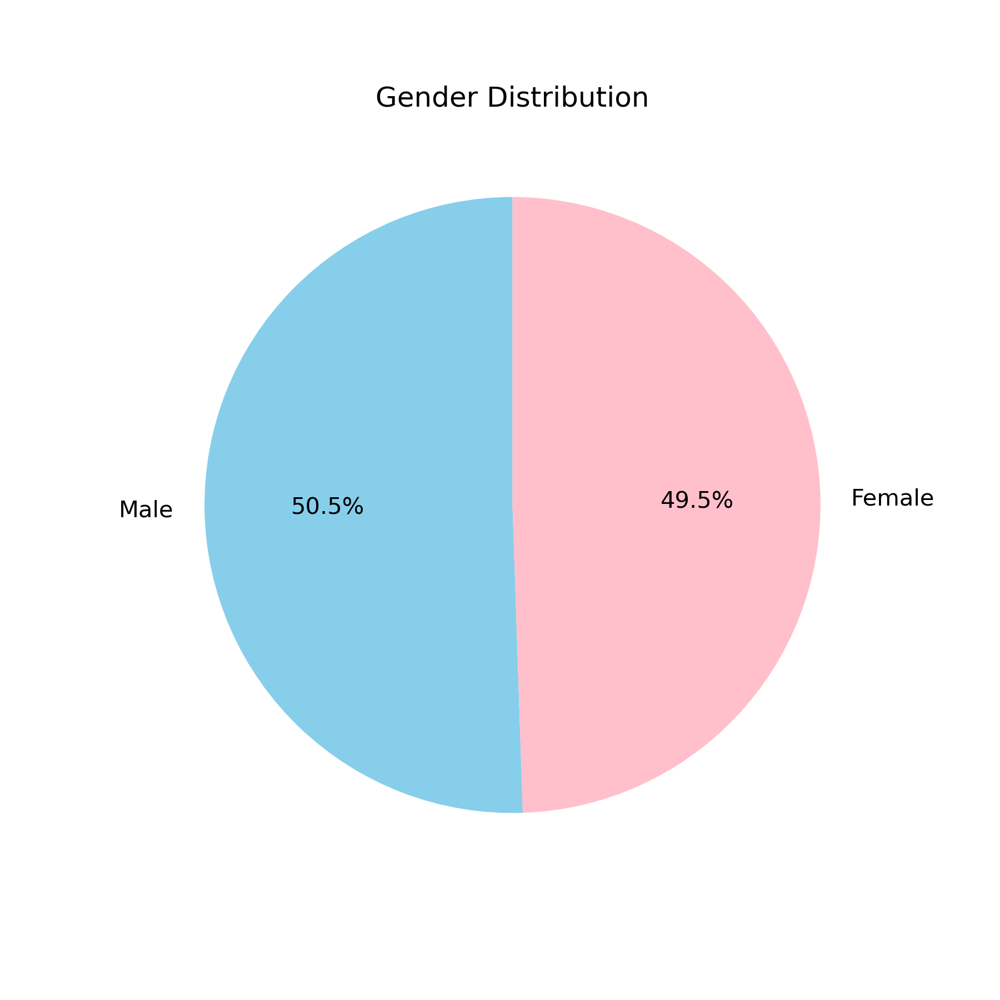
</td>
<td width="50%" style="border: none;">

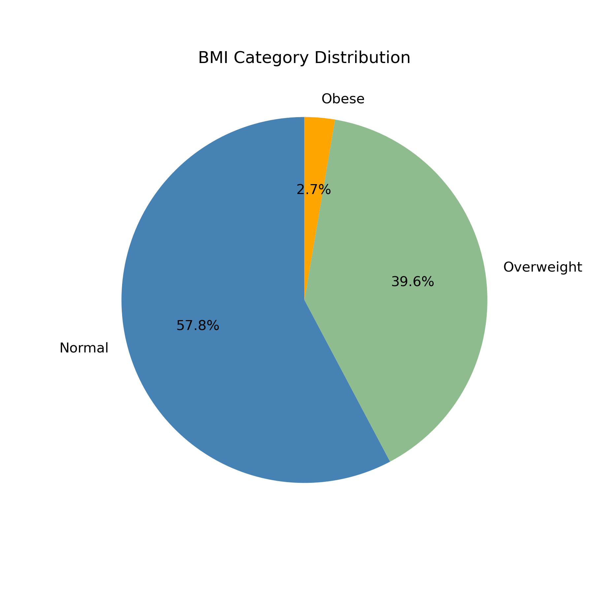
</td>
</tr>
</table>

**Key Observations:**
- The gender distribution of this data is 50.5% for males and 49.5% for females.
- The largest distribution of BMI categories is Normal at 57.8%, Overweight at 39.6%, and Obese at 2.7% respectively.
- In the distribution of occupation, the largest number is Nurse, followed by Doctor and Engineer.

### 2. Sleep Duration Analysis

#### 2.1 Distribution of Sleep Duration
The bar chart illustrates the overall distribution of participants' nightly sleep duration.

**Key Observations:**
- Most participants sleep between 6-8 hours, aligning with health recommendations.
- Three distinct peaks appear at 6.5, 7.5, and 8.0 hours, showing common sleep patterns.
- Smaller portions sleep less than 6 or more than 8.5 hours, indicating outlier sleep patterns.

#### 2.2 Average Sleep Duration by BMI and Gender
This chart compares average sleep duration across BMI categories for males and females.
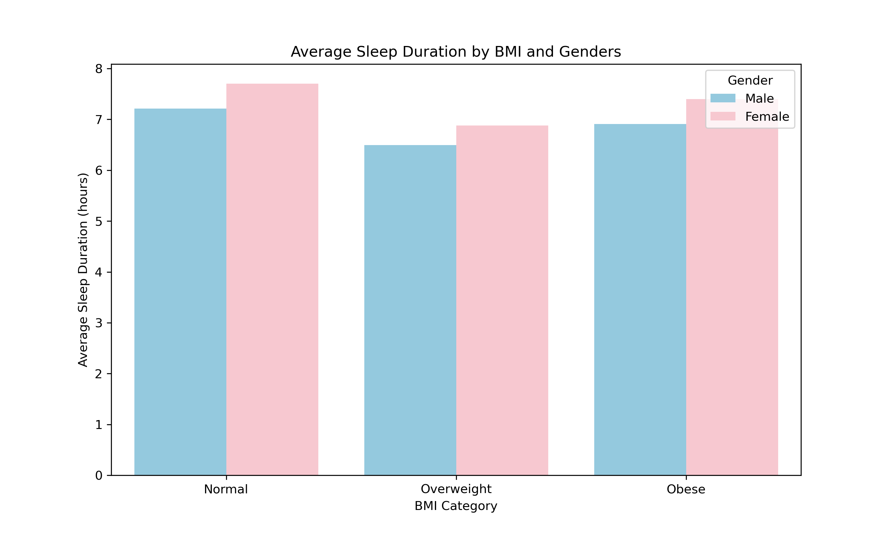

**Key Observations:**
- Normal BMI participants sleep longest (~7.5-8 hours), suggesting a link between balanced weight and adequate rest.
- Overweight and obese groups show slightly shorter sleep duration.
- Females consistently sleep longer than males across all BMI categories.

#### 2.3 Average Sleep Duration by Occupation
This chart illustrates how sleep duration varies among different occupation.

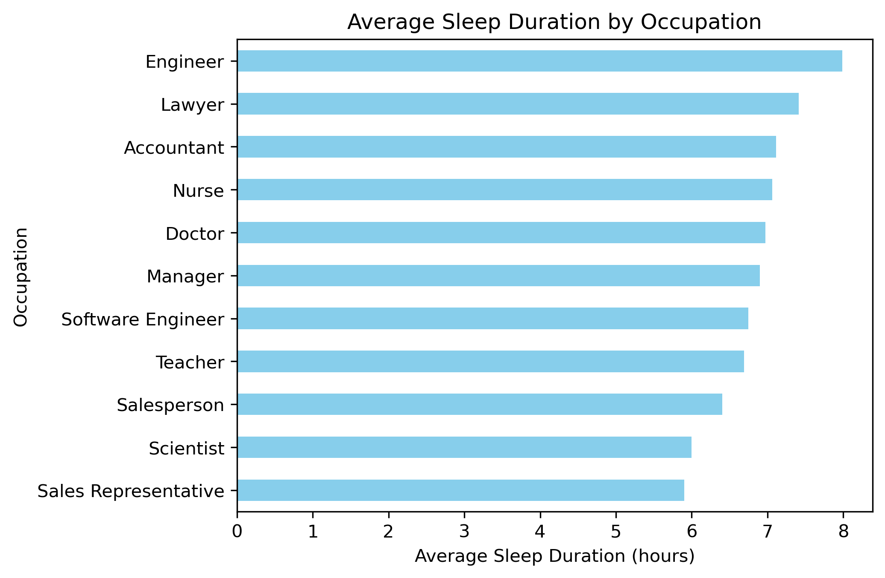
**Key Observations:**
- Engineers report the longest average sleep duration (~8 hours).
- Sales Representatives and Scientists show the shortest durations (~6-6.5 hours).
- Healthcare professions (nurses, doctors) and office workers (lawyers, accountants, managers) maintain durations around 7-7.5 hours.
- Clear occupational disparities exist, with nearly 2-hour difference between highest and lowest groups.

#### 2.4 Average Sleep Duration by Sleep Disorder
This bar-chart compares average sleep duration among individuals with and without reported sleep disorders.
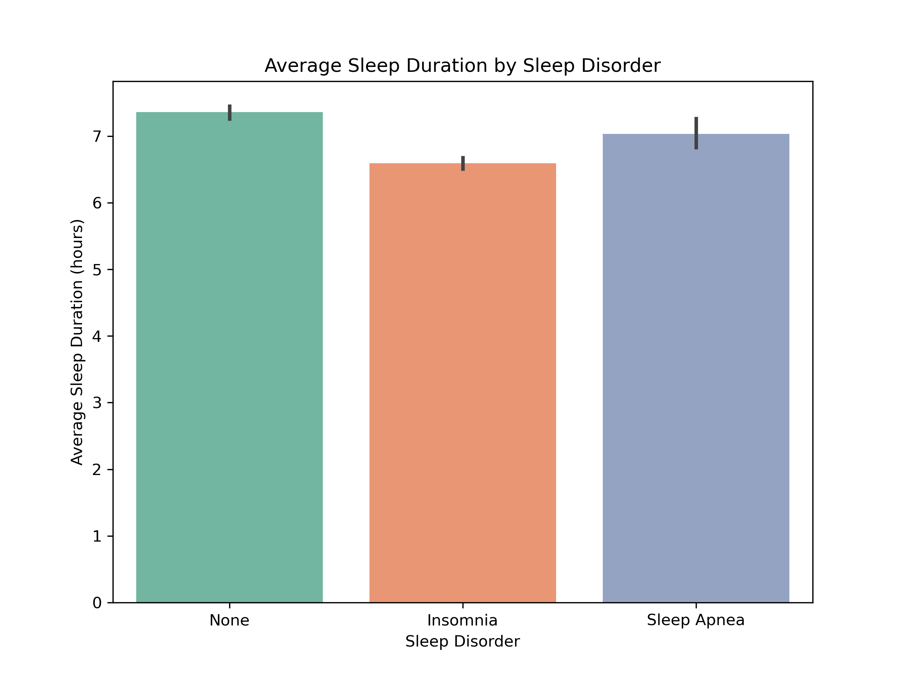
**Key Observations:**
- Participants without sleep disorders show the longest average duration (~7.4 hours), reflecting healthy sleep patterns.
- Insomnia sufferers display the lowest quality (~6.5), indicating consistently poor sleep.
- Sleep apnea participants average ~7 hours, slightly below the healthy group.
- All groups fall within or near the recommended 6-8 hour range, though disorder groups trend lower.

### 3. Quality of Sleep Analysis
#### 3.1 Distribution of Sleep Quality
The chart displays the overall distribution of sleep quality scores across participants.
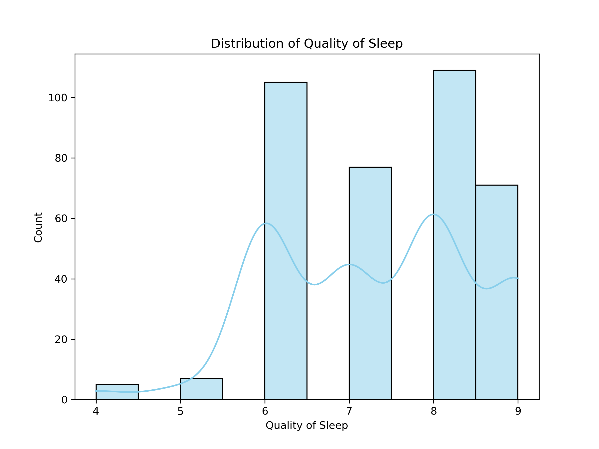
**Key Observations:**

- Most individuals report sleep quality ratings between 6-8.
- Two prominent peaks at quality scores of 6 and 8 suggest distinct sleep experience groups.
- Very few participants report poor sleep quality (scores 4-5), showing right-skewed distribution.
- A substantial portion achieves high quality scores (8-9), representing optimal sleep experiences.

#### 3.2 Average Quality of Sleep by BMI and Gender
This chart compares average sleep quality across BMI categories for male and female participants.
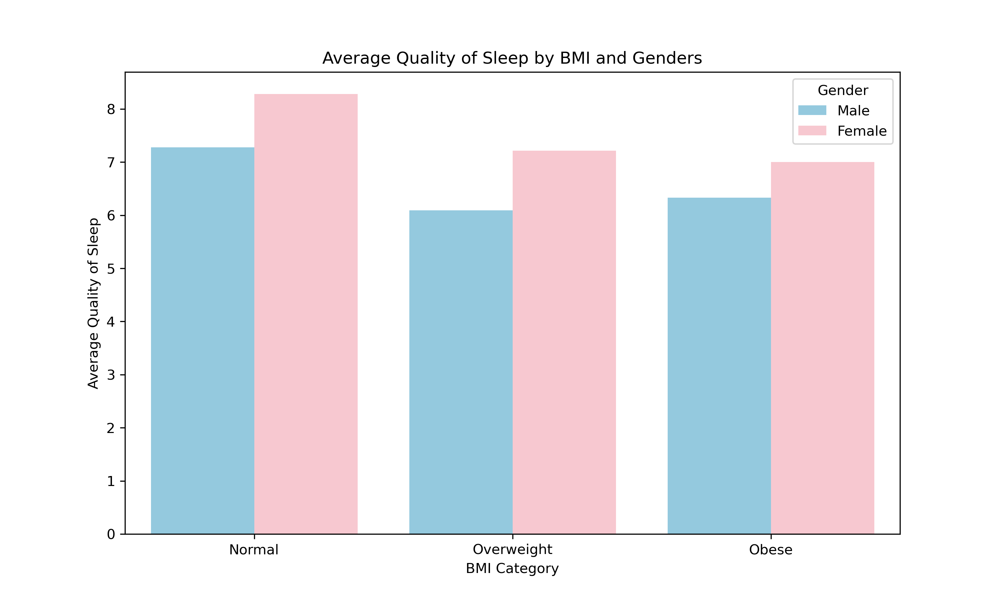
**Key Observations:**

- Normal BMI participants report the highest sleep quality (~8 for females, ~7.5 for males).
- Overweight and obese groups show noticeable decline in sleep quality across both genders.
- Females consistently rate sleep quality slightly higher than males in each BMI category.

#### 3.3 Average Sleep Quality by Occupation

This bar chart highlights differences in average sleep quality across occupations.
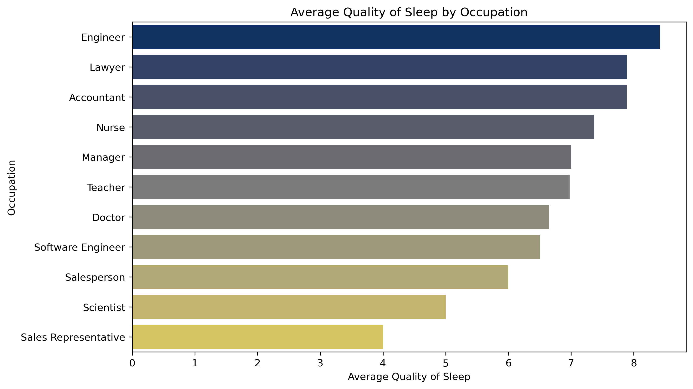
**Key Observations:**

- Engineers and lawyers report the highest sleep quality, suggesting better work-life balance or consistent routines.
- Healthcare roles (nurses, doctors) fall in the mid-range, possibly due to irregular schedules or shift work.
- Teachers, salespersons, and scientists show lower average sleep quality.
- Sales Representatives report the lowest sleep quality among all occupations.

#### 3.4 Average Quality of Sleep by Sleep Disorder
This visualization illustrates how sleep disorders affect the overall quality of sleep among participants.

**Key Observations:**

- Participants without sleep disorders report the highest average quality (~7.6).
- Insomnia sufferers display the lowest quality (~6.5), indicating consistently poor sleep.
- Sleep apnea shows moderate average (~7.1) but with notable variability in individual experiences.

#### 3.5 Stress Level vs Quality of Sleep
This scatter plot examines the relationship between stress levels and sleep quality ratings.
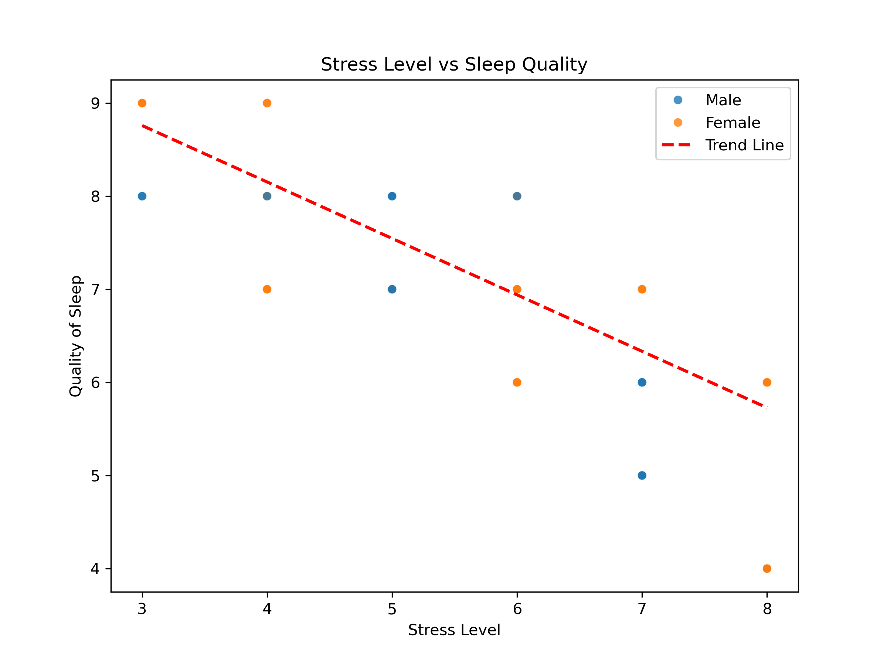
**Key Observations:**

- A strong negative  correlation between stress and sleep quality.
- Higher stress levels consistently associate with lower sleep quality scores.
- Trend line shows clear downward pattern across both genders.

#### 3.6 Physical Activity vs Quality of Sleep
This scatter plot explores how physical activity levels relate to sleep quality.
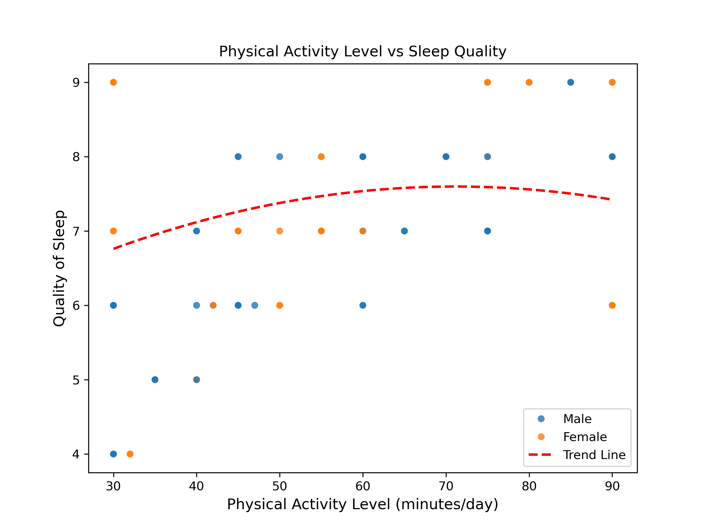
**Key Observations:**

- Curvilinear relationship shows an inverted U-shape pattern with peak around 50-70 minutes/day.
- Moderate physical activity (50-80 minutes/day) associates with highest sleep quality scores (8-9).
- Very low activity (<40 minutes) and very high activity (>80 minutes) show more variable sleep quality.

### 4.Sleep Disorder Analysis
#### 4.1 Frequency of Sleep Disorders
This chart displays the distribution of sleep disorders among participants in the dataset.

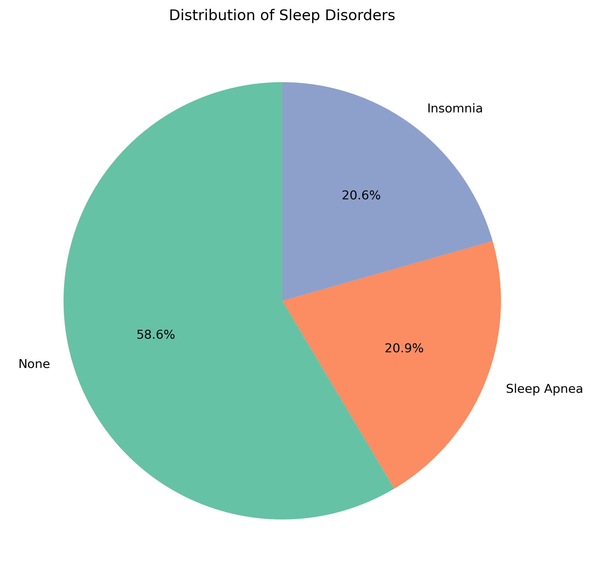

**Key Observations:**
- Majority of participants (58.6%) report no sleep disorders.
- Sleep apnea affects 20.9% of the population, slightly more prevalent than insomnia.
- Insomnia accounts for 20.6% of participants.
- Combined, 41.4% of the sample experiences some form of sleep disorder, indicating significant prevalence.

#### 4.2 Sleep Disorders by Gender
This section examines the distribution of sleep disorders across male and female participants.
<table style="border: none;">
<tr>
<td width="50%" style="border: none;">

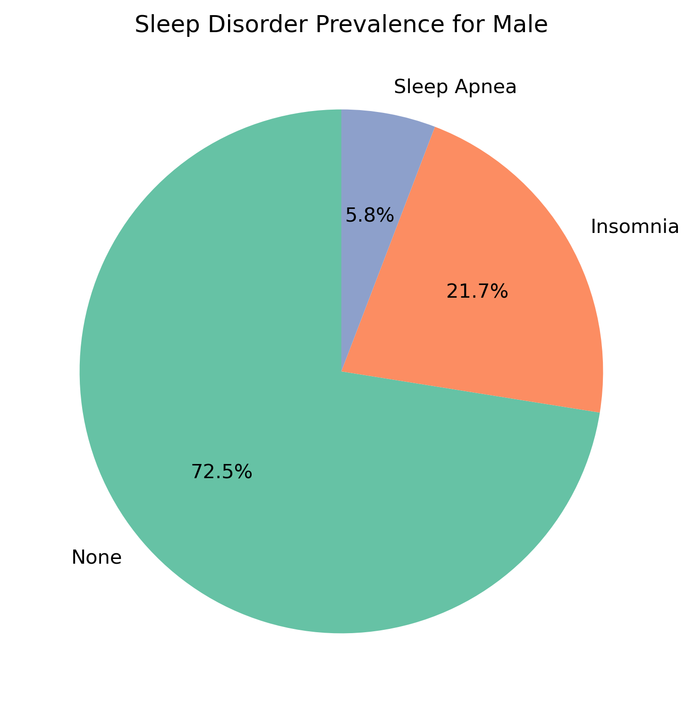
</td>
<td width="50%" style="border: none;">

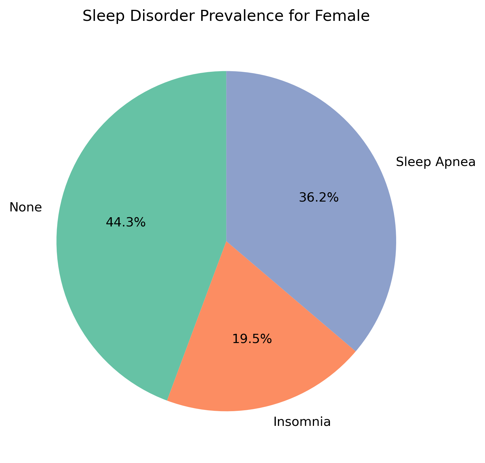

</td>
</tr>
</table>

**Key Observations:**
- Males show higher prevalence of no sleep disorders (72.5%) compared to females (44.3%).
- Females exhibit significantly higher rates of sleep apnea (36.2%) versus males (5.8%).
- Insomnia prevalence is similar across genders (males: 21.7%, females: 19.5%).
- Overall, females experience sleep disorders at higher rates than males in this dataset.

#### 4.3 Sleep Disorders by BMI Category
This chart examines the relationship between BMI categories and sleep disorder prevalence.
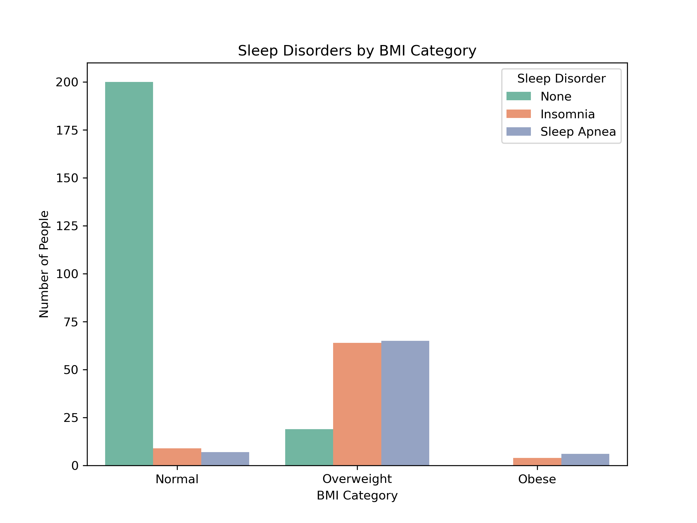
**Key Observations:**
- Normal BMI participants show the lowest sleep disorder rates (~200 without disorders).
- Overweight category has the highest prevalence of both insomnia and sleep apnea (~65 each).
- Obese category shows fewer total participants but higher disorder rates relative to healthy individuals.

#### 4.4 Sleep Disorders by Occupation
This chart shows the percentage distribution of sleep disorders across different occupations.
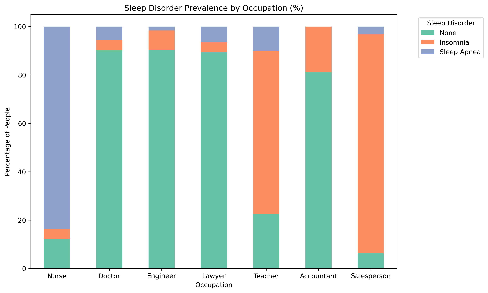
**Key Observations:**

- Salespersons show the highest insomnia prevalence (~90%), with minimal sleep apnea.
- Nurses exhibit predominantly sleep apnea (~95%), likely related to shift work impacts.
- Teachers display balanced distribution with notable insomnia rates (~67%).
- Engineers, lawyers, doctors, and accountants maintain relatively high rates without sleep disorders (>85%).

#### 4.5 Quality of Sleep by Sleep Disorder
This boxplot illustrates the distribution and variability of sleep quality across different sleep disorder categories
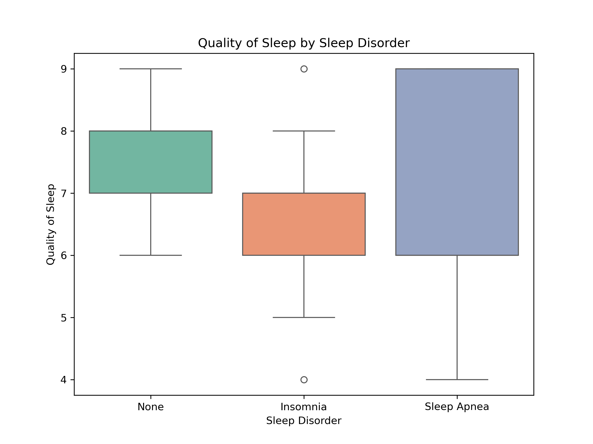
**Key Observations:**

- Participants without disorders show consistent quality (median ~7.5, range 6-9).
- Insomnia group displays the lowest median (~6.5) with moderate variability (range 4-8).
- Sleep apnea shows highest variability (range 4-9), suggesting differing severity levels or management effectiveness.
- Presence of outliers in both disorder groups indicates individual variation in sleep experiences.

#### 4.6 Stress Level by Sleep Disorder
This boxplot examines the relationship between stress levels and sleep disorder categories.
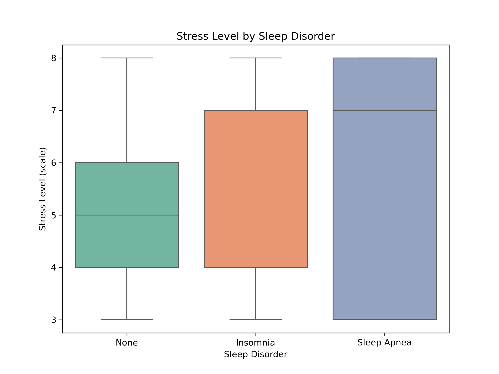
**Key Observations:**

- Participants without sleep disorders show the lowest stress levels (median ~5, range 3-8).
- Insomnia group displays moderate stress levels (median ~7, range 3-8).
- Sleep apnea sufferers exhibit the highest stress levels (median ~7, range 3-8).

### 5. Key Findings 
This comprehensive analysis of 400 participants reveals critical insights into the complex relationships between sleep patterns, lifestyle factors, and overall health. The findings show that sleep health is affcted by multiple interconnected factors including body weight (BMI), occupation, stress levels, physical activity, and the presence of sleep disorders.

#### 5.1 Sleep Duration Insights
The analysis of sleep duration reveals that most participants maintain sleep durations within the recommended 6-8 hour range, with notable peaks around 6.5 and 7.5 hours. However, BMI emerges as a significant predictor of sleep duration, with normal-weight individuals consistently sleeping longer (~7.5-8 hours) compared to overweight and obese groups. This pattern displays the same trend across both genders, though females consistently report slightly longer sleep durations than males across all BMI categories.

Occupational factors play a crucial role in determining sleep duration. Engineers achieve the longest average sleep (~8 hours), while sales-related professions (salespersons and representatives) report the shortest durations (~6 hours). High-stress professions such as nurses and doctors show moderately reduced sleep hours, likely reflecting the impact of demanding schedules and shift work.

The relationship between sleep disorders and duration is particularly striking. Individuals without sleep disorders average 7.4 hours of sleep, while insomnia sufferers report significantly shorter durations (~6.6 hours). Sleep apnea participants fall in between (~7 hours), though the quality of their sleep remains compromised despite adequate duration.

#### 5.2 Sleep Quality Patterns
Sleep quality ratings cluster between 6-8 on a 10-point scale, with a right-skewed distribution indicating that most participants experience moderate to good sleep quality. However, a clear hierarchy emerges when examining quality across different factors.

BMI shows a consistent inverse relationship with sleep quality. Normal-weight individuals report the highest quality scores (~8 for females, ~7.5 for males), while overweight and obese groups experience relatively lower quality. This pattern suggests that excess body weight may contribute to sleep fragmentation, breathing difficulties, or other factors that compromise restfulness.

Occupational differences in sleep quality mirror the duration findings. Engineers and lawyers report the highest quality, while teachers, salespersons, and scientists show notably lower ratings. This discrepancy highlight how the factors of work environment, job demands, and stress levels are directly associated with perceived sleep quality, independent of sleep duration.

The most profound finding relates to stress levels and sleep quality, which demonstrate a strong negative correlation. As stress increases, sleep quality consistently decreases across both genders. This relationship underscores stress management as perhaps the most modifiable and impactful factor for improving sleep outcomes.

Physical activity shows a curvilinear relationship with sleep quality, revealing an optimal "moderate activity" around 50-80 minutes per day. Both sedentary lifestyles (<40 minutes) and excessive activity (>80 minutes) associate with more variable and generally lower sleep quality, suggesting that moderate exercise provides the greatest sleep benefits.

#### 5.3 Sleep Disorder Analysis
Approximately 41.4% of participants (150 out of 400) experience diagnosed sleep disorders, split evenly between insomnia (~75 cases) and sleep apnea (~75 cases). This prevalence rate is crucial and calls for serious attention to sleep health interventions.

Gender differences in disorder prevalence are striking. While 72.5% of males report no sleep disorders, only 44.3% of females are disorder-free. Most notably, sleep apnea affects 36.2% of females compared to just 5.8% of males in this dataset. Insomnia rates are more comparable across genders (males: 21.7%, females: 19.5%).

BMI emerges as a critical risk factor for sleep disorders. Normal-weight individuals show the lowest disorder prevalence, while the overweight category exhibits the highest rates of both insomnia and sleep apnea. This finding aligns with established research linking obesity to sleep-disordered breathing and other sleep disturbances.

Occupational patterns reveal remarkable trends. Salespersons show the highest insomnia prevalence (~90%), while teachers display notable insomnia rates (~67%). Nurses exhibit high sleep apnea rates (~95%), likely reflecting the impact of shift work on circadian rhythms. Conversely, engineers, lawyers, doctors, and accountants maintain relatively low disorder rates despite demanding careers.

The quality-of-life impact is evident: individuals with sleep disorders consistently report lower sleep quality and higher stress levels. Insomnia sufferers show the lowest quality ratings (~6.5) with consistent patterns, while sleep apnea demonstrates high variability (range 4-9), suggesting differences in condition severity or treatment effectiveness. Importantly, both disorder types associate with elevated stress levels, indicating either that stress contributes to disorder development or that disorders exacerbate stress—bidirectional relationship.

### 6. Conclusions 
In summary, this analysis demonstrates that sleep health is a multifaceted phenomenon influenced by biological, behavioral, and environmental elements. The strong associations between BMI, stress, physical activity, occupation, and sleep outcomes suggest that effective interventions must not be a single-issue focused.

The most actionable insights are:

1. Stress management should be the primary target for most individuals seeking to improve sleep quality.
2. Weight optimization provides dual benefits for both sleep duration and quality while reducing disorder risk.
3. Moderate physical activity (50-80 min/day) represents an optimal range for sleep benefits.
4. Certain occupations face compounded risks requiring targeted workplace interventions and improvements.
5. Sleep disorders are prevalent (41.4%) and often undiagnosed, particularly sleep apnea in women.

By addressing these modifiable factors through individual behavior change, workplace interventions, and healthcare system improvements, substantial gains in population sleep health are achievable. Given sleep's fundamental to physical and mental health, and quality of life, these insights represent high-value opportunities for improving public health outcomes.

### 7. Recommendations
Based on these findings aboved, several recommendations can be proposed:

**1. Occupational Wellness Programs:**
High-risk professions (sales, teaching, healthcare) should implement targeted sleep health and stress management programs to address occupation-specific sleep challenges.

**2. Workplace Environment Optimization:**
Organizations should evaluate and adjust work environments, schedules, and workload demands—particularly for high-stress roles—to support healthier sleep patterns and work-life balance.

**3. Sleep Health Education Initiatives:**
Provide comprehensive education on sleep's critical role in physical and mental health, emphasizing the connections between lifestyle factors (stress, activity, weight) and sleep quality for at-risk populations.

**4. Weight Management Integration:**
Encourage individuals with elevated BMI to adopt holistic health programs that address both weight optimization and sleep improvement, recognizing their interconnected benefits.

**5. Proactive Screening and Support:**
Establish routine sleep disorder screening and consulting services, especially for professions requiring high alertness and individuals showing multiple risk factors (elevated BMI, high stress, irregular live schedules).

These evidence-based recommendations aim to improve sleep health across demographic and occupational groups by addressing modifiable risk factors through individual behavior change, workplace interventions, and healthcare system quality, ultimately improving better belance towards health and lifestlye.